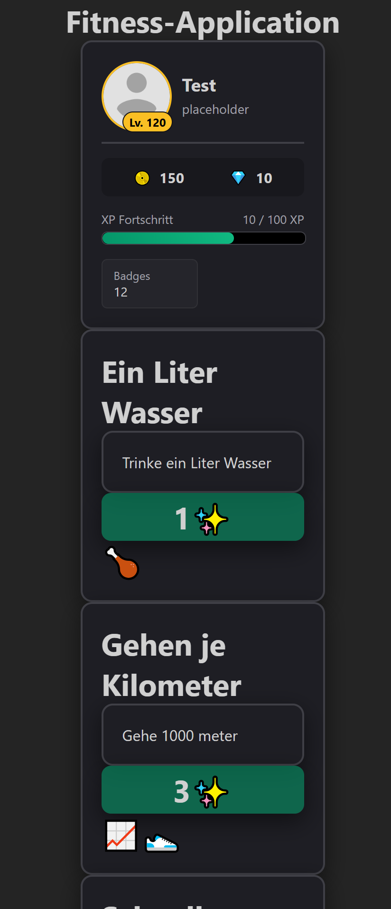

# Fitness Tycoon 🏃‍♂️
Erbaue dein eigenes Fitness-Wunderland – während du gleichzeitig im *echten Leben* gesünder lebst! **FitnessTycoon** verbindet den Suchtfaktor eines klassischen 2D-Clicker-Spiels mit echten Fitness-Herausforderungen.

## 🌟 Hauptfeatures

* **Clicker & Reallife-Mix:** Generiere Ressourcen im Spiel durch Klicks und baue dein Fitness-Imperium aus.

* **Karten-System: * Kaufen & Aufwerten:** Investiere deine In-Game-Währung in verschiedene Karten.

* **Raritäten:** Höhere Seltenheitsstufen erhöhen die Effektivität und den Multiplikator deiner Karten.

* **Materialien:** Bessere Materialien verlängern die Laufzeit und Haltbarkeit (Durability).

* **Makellose Karten:** Die seltensten Karten gehen niemals kaputt!

* **Badges & Multiplikatoren:** Sammle Erfolge, um mächtige XP- und Geld-Multiplikatoren freizuschalten.

* **Prestige / Wiedergeburten:** Setze deinen Fortschritt clever zurück, um den Workflow und deine Basis-Stats dauerhaft zu steigern.

* **Reallife-Quests:** Erfülle echte Fitness-Aufgaben für exklusive In-Game-Belohnungen. (Vertrauensbasiert – sei kein Cheater, das schadet nur deinem eigenen realen Fortschritt!)

## 🏋️‍♂️ In-Game Objekte
Im Spiel kannst du eine Vielzahl von Objekten freischalten, sammeln und verbessern:

* **Gewichte** (Hanteln, Langhanteln, Kettlebells)

* **Getränke** (Proteinshakes, Energy-Boosts, Wasser)

* **Essen** (Gesunde Mahlzeiten, Snacks, Ernährungspläne)

* **Gebäude** (Erweiterungen für dein Fitnessstudio)

* **Fitness-Geräte** (Laufbänder, Kraftstationen, Rudergeräte)

* **Und vieles mehr!**

## 🚀 Erste Schritte (Installation & Setup)
1. Repository klonen: 
```bash
git clone https://github.com/DeinBenutzername/fitness-application.git
```
2. Projekt öffnen:
Öffne den Ordner in deiner bevorzugten Entwicklungsumgebung (z. B. VS Code).
3. Spiel starten:
Führe die entsprechende Start-Datei aus, um in dein Fitness-Abenteuer zu starten!

## 🤝 Mitwirken (Contributing)
Beiträge, Vorschläge und Bugreports sind herzlich willkommen!

1. Forke das Repository
2. Erstelle einen Feature-Branch
```bash
git checkout -b feature/<feature_titel>
```
3. Committe deine Änderungen
```bash
git commit -m 'Add: Neues Feature hinzugefügt'
```
4. Push zum Branch
```bash
git push origin feature/<feature_titel>
```
5. Öffne einen Pull Request

## 📄 Lizenz
Dieses Projekt ist unter der GPL-V3-Lizenz veröffentlicht. Weitere Informationen findest du in der LICENSE-Datei.

